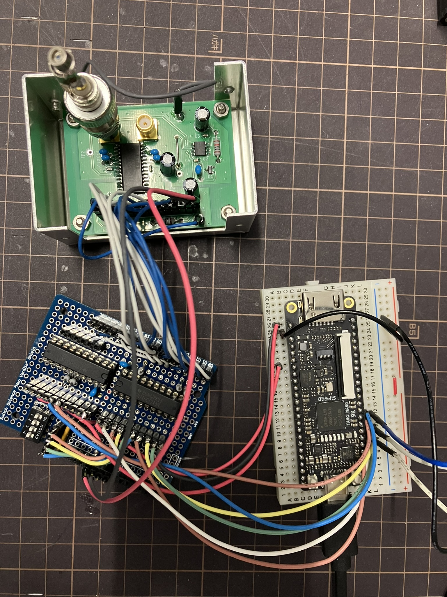
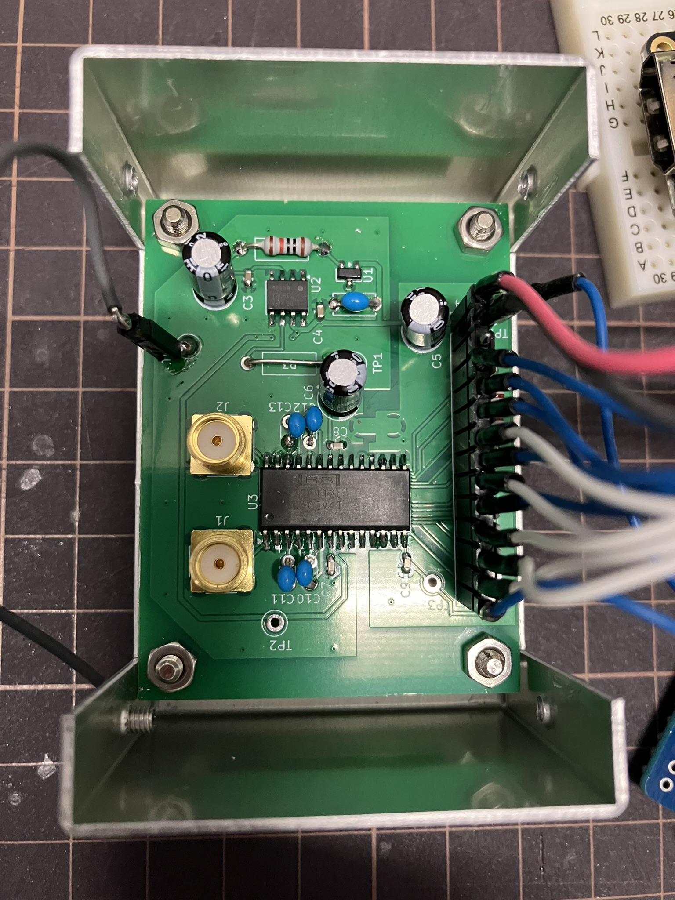

## Hardware setup

### Complete prototype

  

Tang Nano 9K FPGA controller connected to the custom DDC112 analog front-end.

### Custom DDC112 board

  

Custom PCB based on the Texas Instruments DDC112 dual-channel current-input ADC.

<!--  --->
# tang-nano-9k-ddc112

FPGA controller and Verilog/SystemVerilog readout implementation for the Texas Instruments DDC112 dual-channel 20-bit current-input ADC using the Sipeed Tang Nano 9K and Gowin FPGA.

This project is intended as a minimal working example for medical physics instrumentation and detector readout experiments.

## Status

- DVALID falling-edge detection confirmed
- DXMIT control implemented
- 40 DCLK pulse readout implemented
- DOUT response to photodiode light confirmed on oscilloscope
- CH1 / CH2 readout confirmed

## Hardware

- Sipeed Tang Nano 9K
- TI DDC112
- Photodiode input
- External level shifting may be required depending on logic levels

KiCad design files are available in:

[`hardware/kicad/`](hardware/kicad/)

The PCB was designed around the Texas Instruments DDC112
dual-channel current-input ADC.

## Notes

This repository contains experimental FPGA readout code developed for medical physics instrumentation research.

This is an experimental implementation, not an official TI reference design.
Timing and pin assignments should be verified for each hardware setup.

Constraint files are currently placed under src/ for simplicity.

## Acknowledgements

This project was inspired in part by Frédérik Berthiaume's
[Picoammeter project on Hackaday.io](https://hackaday.io/project/176095-picoammeter),
which uses the DDC112 analog front end with an FPGA-based readout.

The hardware and FPGA implementation in this repository were developed
independently for the Tang Nano 9K platform.
