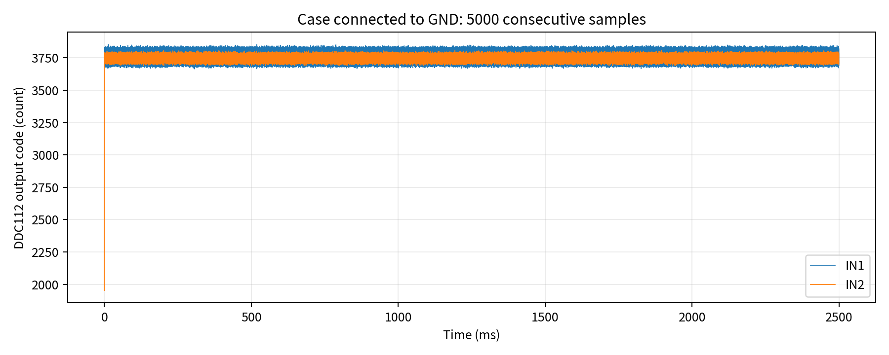
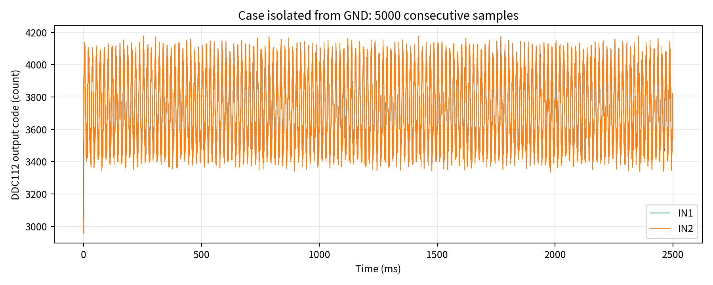

# DDC112 noise test: effect of enclosure grounding

This note documents a 5000-sample noise test of a custom DDC112 + Tang Nano 9K readout board.

## Test conditions

- ADC: Texas Instruments DDC112
- Input condition: open input
- Integration time: 0.5 ms
- Full-scale range: 50 pC
- Acquisition: 5000 consecutive samples
- Channels: IN1 and IN2
- Compared conditions:
  1. Aluminum enclosure connected to circuit GND
  2. Aluminum enclosure electrically isolated from circuit GND

For steady-state statistics, the first 10 samples (5 ms) were excluded.

## Main result

After correcting the fixed A/B integrator offset separately for even and odd samples, the RMS fluctuation was:

| Condition | Channel | A/B-corrected SD (count) | Equivalent charge noise (fC RMS) | Equivalent input-current noise (pA RMS) |
|---|---:|---:|---:|---:|
| Enclosure connected to GND | IN1 | 6.19 | 0.295 | 0.59 |
| Enclosure connected to GND | IN2 | 6.31 | 0.301 | 0.60 |
| Enclosure isolated from GND | IN1 | 202.6 | 9.66 | 19.3 |
| Enclosure isolated from GND | IN2 | 204.4 | 9.75 | 19.5 |

Grounding the enclosure reduced the A/B-corrected RMS fluctuation by approximately **33× (IN1)** and **32× (IN2)**.

At a nominal 50 pC full scale,

- 1 count = 0.0477 fC
- 1 count over 0.5 ms = 0.0954 pA

Therefore the grounded configuration achieved approximately **0.6 pA RMS equivalent input-current noise** in both channels.

> This is a short-term noise figure derived from an open-input measurement. It is not a calibrated absolute-current accuracy specification.

## Time-series comparison

### Enclosure connected to GND

### Enclosure isolated from GND

The isolated case shows large common excursions in IN1 and IN2. This suggests that much of the additional fluctuation is externally coupled/common-mode interference rather than independent channel noise.

A frequency-domain check of the same isolated data shows a dominant component at approximately **60.1 Hz** in both channels, with a smaller component near **120 Hz**. This is consistent with pickup from the local 60 Hz mains environment. After connecting the aluminum enclosure to GND, the pronounced 60 Hz component is no longer dominant.

## A/B integrator offset

The DDC112 uses two alternating integrators per input. A fixed difference between the A and B paths appears as an even/odd two-state pattern.

In the grounded measurement, the A/B mean separation was:

- IN1: 145.1 counts
- IN2: 81.9 counts

The raw SD is therefore not a good estimate of random noise unless the two integrator paths are calibrated separately.

## Interpretation

The result demonstrates three practical points:

1. **The enclosure-ground connection is essential** for low-noise operation in this setup.
2. **A/B integrator calibration matters** because the fixed alternating offset can dominate the uncorrected standard deviation.
3. With the enclosure grounded and the A/B offset removed, the present system shows **sub-pA RMS short-term repeatability** at 0.5 ms integration.

The RMS noise corresponds to roughly **17.4–17.3 bits of dynamic range referenced to the 20-bit full scale**, but this should not be called ADC ENOB because linearity, gain error, drift, and absolute calibration are not included.

## Relation to the DDC112 datasheet

The DDC112 datasheet specifies a 20-bit continuous integrating architecture and emphasizes careful analog grounding, shielding around the high-impedance inputs, short analog connections, and separation of digital signals from analog inputs.

The datasheet also gives a typical low-level input-noise figure of 3.2 ppm FSR RMS under a different test condition (250 pC range, 0 pF sensor capacitance, 500 µs integration). Because the range and board conditions differ, the value should not be compared directly with the present 50 pC measurement.

Reference: Texas Instruments, *DDC112 Dual Current Input 20-Bit Analog-to-Digital Converter*, SBAS085B.

## Files

- `images/timeseries_case_grounded.png`
- `images/timeseries_case_isolated.png`
- `../summary_metrics.csv`

## Next measurements

Planned next steps:

- Calibrate A/B offsets independently
- Repeat after a fixed warm-up period
- Compare open input vs. input short
- Inject a known small current
- Acquire 10,000–100,000 samples for PSD and Allan-deviation analysis
- Log temperature during long-term drift tests
